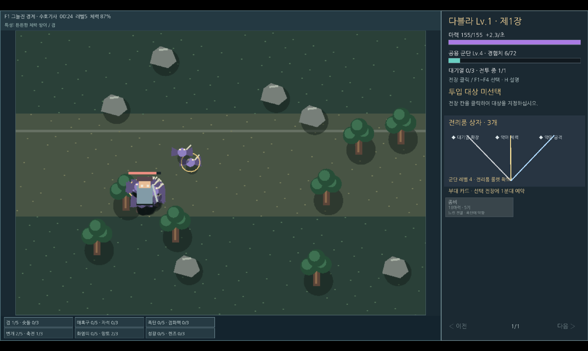
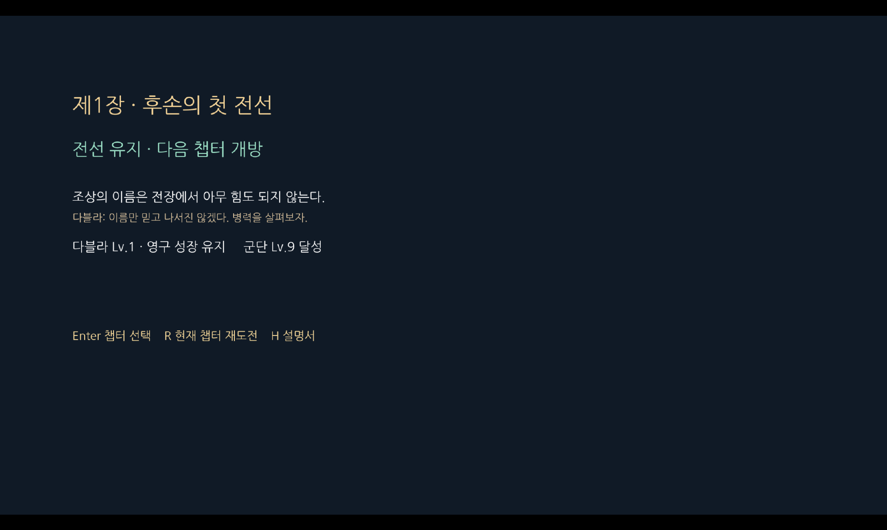
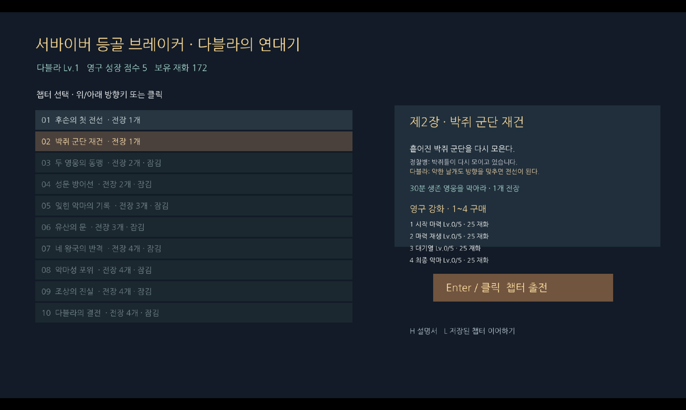

# 서바이버 등골 브레이커

악마 다블라의 군단을 지휘해 영웅을 상대하는 10챕터 게임.

[브라우저에서 플레이](https://seowooyoo2014.github.io/survivor-spine-breaker/) · [게임 방법](docs/gameplay.md) · [실행 방법](docs/running.md) · [아키텍처](docs/architecture.md) · [사용 기술](docs/technology.md) · [발전 히스토리](docs/history.md) · [검증](docs/verification.md) · [에셋](docs/assets.md)

## 화면

2026-09-25 독립 복사본의 브라우저 실행 화면에서 촬영했습니다. Safari PDF 내보내기 방식이라 일부 CSS 글자와 어두운 장면은 화면 표시와 다를 수 있습니다. 이전 버전에서 보존한 화면은 원본의 다른 스크린샷 파일로 구분합니다.

## 실행

Godot 4.3 이상에서 `project.godot`을 열고 F5를 누릅니다. 기본 장면은 `multi_observer.tscn`입니다.
