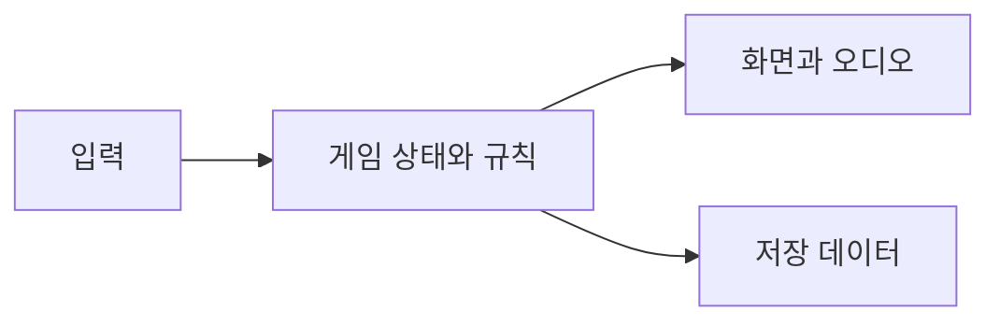

# 아키텍처

`project.godot` → `multi_observer.tscn` → `multi_observer.gd`가 챕터·전장·메타 성장을 관리합니다. `observer.tscn`과 `observer_v1.gd`는 개별 전장을 담당하고 `history_prologue.gd`가 도입부를 재생합니다. 저장은 Godot의 `user://` 경로를 사용합니다.

